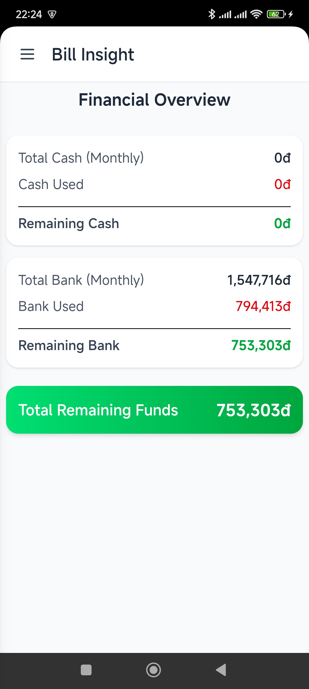
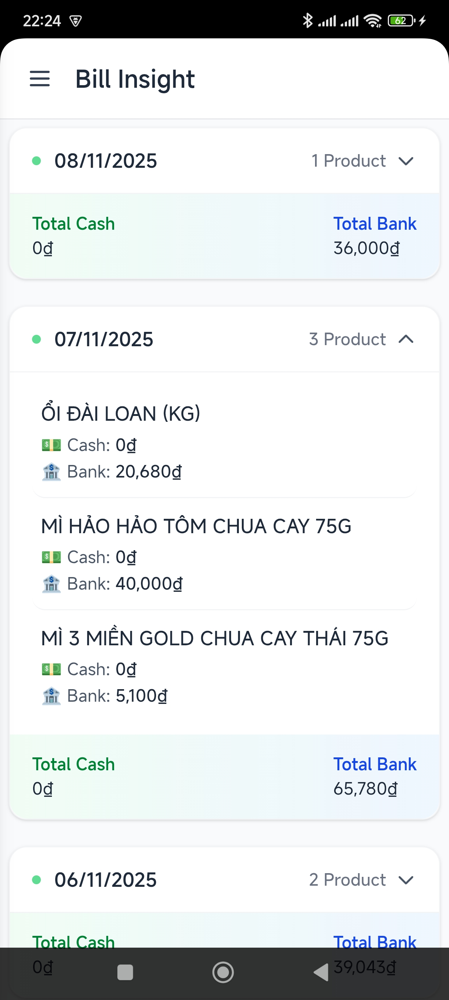
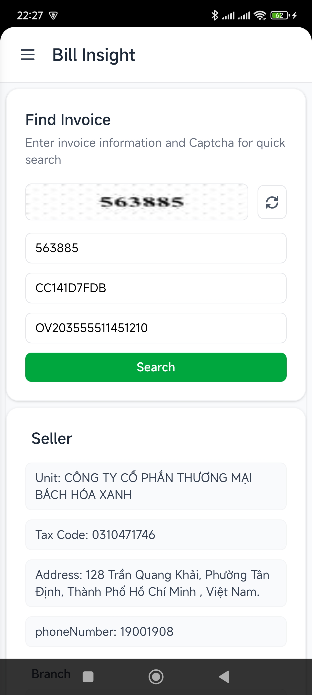
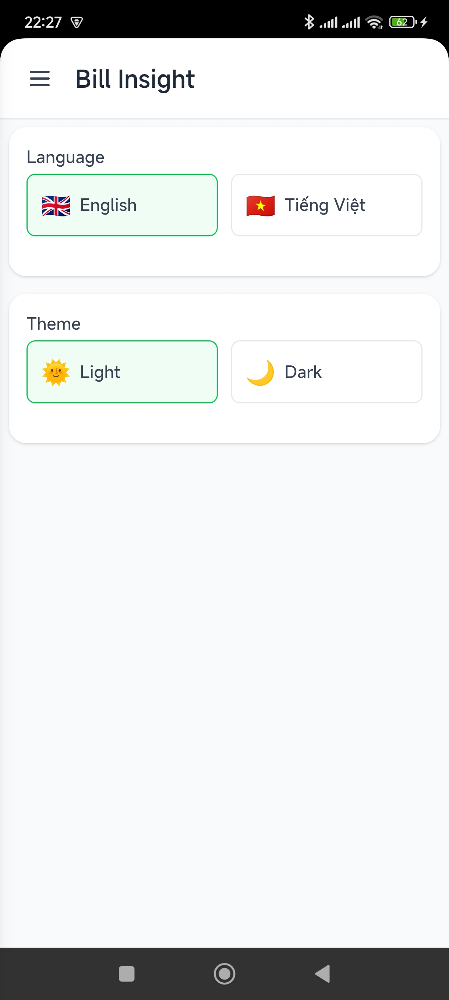

# 💸 Bill Insight — Smart Invoice Management on Google Sheets

    
    
    
    

---

## 🧾 Overview

**Bill Insight** is a lightweight, privacy-focused app that helps you **automatically manage your invoices** using **Google Sheets**.  
The app works entirely **without a centralized server**, keeping all data on **your device and your Google Drive** — ensuring maximum privacy and transparency.

💡 Just connect your Google account once, and Bill Insight handles everything automatically.

---

## 🚀 Key Features

✅ **Auto add invoices** directly to Google Sheets  
✅ **Scan invoice codes and CT codes** using your device’s built-in camera (leveraging the system’s native scanning feature — fast, accurate, and free)  
✅ **Automatic invoice lookup and input** after scanning codes  
✅ **View invoice statistics** with summary insights  
✅ **Invoice list view** — view, edit, or filter entries  
✅ **Rename your Google Sheet** easily  
✅ **Multi-language support** in settings  
✅ **No centralized database** — 100% local + Google Sheets  
✅ **Internet required only for Google API access**

---

## 🧰 Tech Stack

| Component      | Technology                                                       |
| -------------- | ---------------------------------------------------------------- |
| Core Framework | [Tauri](https://tauri.app/) + Rust 🦀                            |
| Frontend       | [Angular](https://angular.dev/) ⚡                               |
| Styling        | [TailwindCSS](https://tailwindcss.com/) 🎨                       |
| Data Sync      | [Google Sheets API](https://developers.google.com/sheets/api) 📊 |

---

## 🛠️ Google API Setup Guide

### 1️⃣ Create a Project in Google Cloud Console

1. Go to [Google Cloud Console](https://console.cloud.google.com/).
2. Create a **new project** (e.g., `Bill Insight`).
3. Enable **Google Sheets API**:
    - Navigate to `APIs & Services` → `Library` → search for **Google Sheets API** → **Enable**.

### 2️⃣ Create a Service Account

1. Go to `APIs & Services` → `Credentials` → **Create credentials** → select **Service Account**.
2. Enter a name and create → under the `Keys` section, choose **Add Key → Create new key → JSON**.
3. Download the **`service_account.json`** file and place it in your app’s config directory.

> ⚠️ **Important Notes:**
>
> -   Keep your `service_account.json` file **private** — never share it publicly.
> -   Share **edit permissions** on your Google Sheet file with your Service Account’s email address (found inside the JSON file).

---

## ⚙️ Initial Setup in Bill Insight

1. Launch **Bill Insight**
2. On first setup, **select your `service_account.json`** file
3. The app will automatically authenticate and connect to your Google Sheet
4. Configure your preferences:
    - 🌐 Language
    - 🗂️ Sheet name
    - 📊 Display mode for invoice statistics

You’re now ready to start tracking your invoices effortlessly! 🚀

---

## 📱 UI Preview

  
  
  
  

  🏠 <b>Dashboard</b> &nbsp; | &nbsp;
  🧾 <b>Invoice List</b> &nbsp; | &nbsp;
  ➕ <b>Add Invoice</b> &nbsp; | &nbsp;
  ⚙️ <b>Settings</b>

---

## 🔒 Privacy-First Design

Bill Insight **never stores or transmits personal data** to any server.  
All data is:

-   Stored **locally on your device**
-   Synced **only with your personal Google Sheet**
-   Never shared with third parties
-   [SpreadSheet template](./docs/template.xlsx)

---

## 🌱 Future Roadmap

✨ OCR-based invoice content recognition (when a free & reliable option becomes available)  
✨ Automatic expense category suggestions  
✨ Monthly summary report export (PDF)  
✨ Cross-device sync support  
✨ Dark Mode interface

---

## 🧑‍💻 Author

👤 **Newtun**  
📧 Email: tinhovinh@gmail.com  
🌐 GitHub: [https://github.com/VinhTin-AQUA](https://github.com/VinhTin-AQUA)

---
